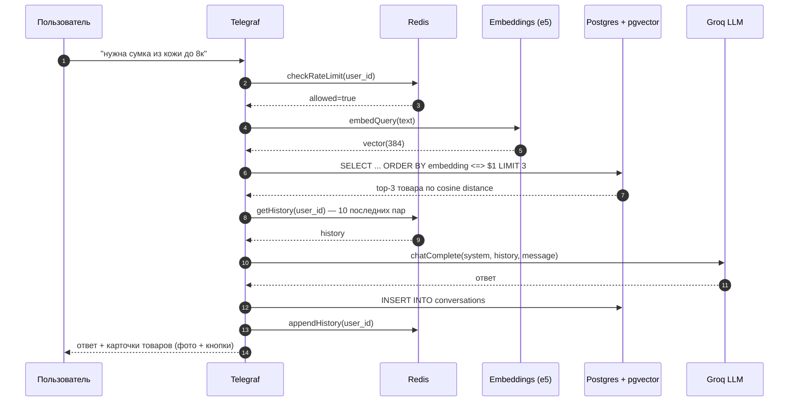
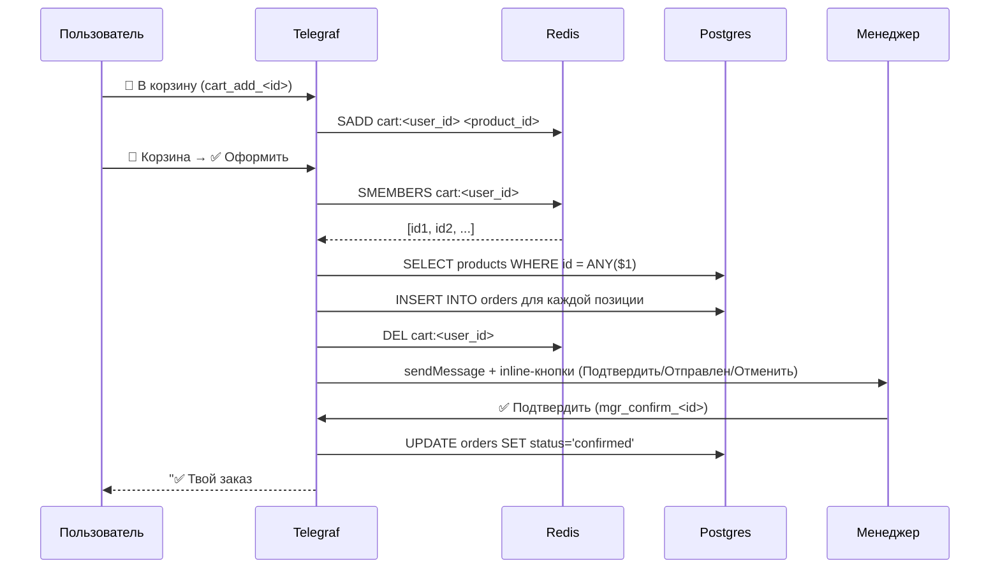
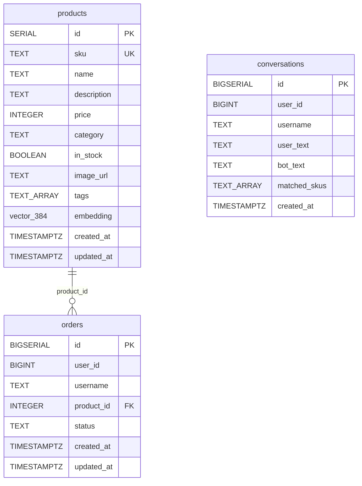
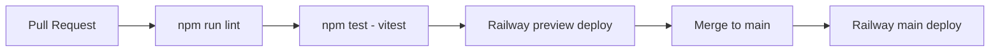

# Архитектура

Документ описывает архитектурные решения, поток данных, схему БД и trade-offs проекта. Дополняет [README](../README.md).

## Цель проекта

Доказать тезис «**розничный магазин в Telegram без if/else на каждый запрос**» — пользователь пишет на естественном языке, бот понимает контекст и подбирает реальные товары из каталога через семантический поиск.

Не цель: универсальный фреймворк для любого бота. Это конкретная вертикаль — розничный магазин — но архитектура переносится на смежные сценарии (службы поддержки с базой статей, FAQ, маркетплейсы).

## Поток обработки сообщения



## Поток оформления заказа



## Схема БД



Индексы:

- `products_embedding_idx` — `ivfflat (embedding vector_cosine_ops) WITH (lists=100)` — приближённый поиск top-K, sub-30ms на каталог в десятки тысяч SKU
- `products_category_idx` — фильтрация по категории
- `orders_user_id_idx`, `orders_status_idx`, `orders_created_at_idx` — выборка истории заказов и фильтрация по статусу
- `conversations_user_id_idx`, `conversations_created_at_idx` — аналитика по пользователю и времени

## Слои приложения

```
┌─ Транспорт ────────────────────────────┐
│ bot.ts   — Telegraf-обработчики        │
│ bootstrap.ts — Railway entry-point     │
└────────────────────────────────────────┘
              │
┌─ UX / форматирование ──────────────────┐
│ ui.ts    — карточки, клавиатуры        │
│ prompt.ts — system prompt + welcome    │
└────────────────────────────────────────┘
              │
┌─ Бизнес-логика ────────────────────────┐
│ rag.ts     — findProducts, featured    │
│ cart.ts    — Redis-корзина             │
│ session.ts — память + rate-limit       │
│ logger.ts  — заказы, диалоги, статусы  │
│ voice.ts   — транскрипция Whisper        │
│ payments.ts — Telegram Payments invoice │
└────────────────────────────────────────┘
              │
┌─ Инфраструктура ───────────────────────┐
│ db.ts, llm.ts, embeddings.ts, log.ts   │
│ redis.ts, embedding-cache.ts, prom.ts  │
│ config.ts, paths.ts, wait-for-db.ts    │
└────────────────────────────────────────┘
```

## Design decisions

### Почему RAG, а не fine-tuning или if/else

- **if/else** не масштабируется на размытые запросы («подарок маме»).
- **fine-tuning** дорогой и каждый раз нужно при изменении каталога — это не каталог-агностично.
- **RAG** — на изменения каталога нужен только `npm run reindex` (минута), без переобучения. Источник истины — БД.

### Почему e5-small (384-dim), а не OpenAI ada/text-embedding-3

- Бесплатно, локально, без API-ключа и квот.
- `multilingual-e5-small` хорошо понимает русский (модель тренирована на 100+ языках).
- 384 dimension — компактнее в pgvector (быстрее индекс и поиск).
- Trade-off: качество чуть ниже OpenAI text-embedding-3-large, но достаточное для каталога в сотни SKU.
- Префиксы `query:` / `passage:` дают заметный буст качества — соблюдены в `src/embeddings.ts`.

### Почему Groq, а не OpenAI / Anthropic

- Бесплатный tier (30 req/min) для портфолио и MVP.
- API совместим с OpenAI Chat Completions — миграция в одну строку.
- Latency 200-400ms против 1-2s у OpenAI — пользователь видит ответ быстрее.

### Почему pgvector, а не Pinecone / Weaviate / Qdrant

- Один сервис вместо двух (Postgres + векторный store).
- Транзакции: каталог и заказы в одной БД.
- Бесплатно в Railway.
- Trade-off: для каталога > 1M документов managed vector DB будет быстрее.

### Почему Telegram polling, а не webhooks

- Polling работает за NAT, без публичного HTTPS-URL.
- Railway даёт публичный URL, но webhook'и сложнее тестировать локально.
- Для трафика < 10 сообщений в секунду разницы нет.
- Health-check Railway: открываем HTTP-сервер в `bootstrap.ts` (там же webhook при BOT_MODE=webhook).

### Корзина: SADD vs LIST

Корзина в Redis сделана через `SADD` (Set):

- Дубликаты SKU не нужны (количество товара в MVP всегда 1).
- `SMEMBERS` за O(N), `SREM` за O(1).
- При расширении до товаров с количеством — переход на `HSET` (Hash: product_id → quantity).

### Структурированные логи (pino)

- В **production** (NODE_ENV=production) — JSON в stdout, Railway сам парсит и индексирует.
- **Локально** — `pino-pretty` (colorized, `HH:MM:ss.l`).
- **Redaction** — поля `password`, `token`, `apiKey`, `authorization` маскируются `[REDACTED]` для защиты от случайных логов секретов.
- Каждый модуль создаёт `child({ module: 'bot' })` — удобно фильтровать в Railway.

### Защита от LLM-галлюцинаций

В `src/prompt.ts`:

- Жёстко прописано: «Цены, sku и характеристики бери ТОЛЬКО из контекста».
- «Если товаров нет — НЕ выдумывай. Скажи что не нашёл».
- Контекст из БД всегда префиксирован: «Доступные товары по запросу клиента:».

Также `RELEVANCE_THRESHOLD = 0.55` в `rag.ts` отсекает заведомо мимо-результаты — лучше показать fallback, чем подсунуть нерелевантный товар.

## Масштабирование

| Узкое место                        | Решение                                                                           |
| ---------------------------------- | --------------------------------------------------------------------------------- |
| Каталог > 100K SKU                 | Увеличить `lists` в IVFFlat (sqrt(n)), либо перейти на HNSW (`pgvector >= 0.5.0`) |
| > 30 req/min Groq                  | Перейти на платный tier или другой LLM (OpenAI, Anthropic, Together)              |
| Высокий QPS                        | Шардировать Redis по user_id, использовать pgbouncer для Postgres                 |
| Embedding на CPU слишком медленный | Перейти на ONNX Runtime GPU или внешний embedding-сервис                          |

## Структура CI/CD



Все стадии — в `.github/workflows/ci.yml`. Каждый PR обязан проходить lint + tests.

## Что НЕ реализовано (но обсуждаемо)

- 💳 Платежи онлайн (Telegram Payments, ЮKassa)
- 📍 Карта с адресами выдачи
- 🌐 Мультиязычность (модель e5 уже мультиязычная, но prompt и UX-тексты на русском)
- 🤖 A/B-тесты разных prompt'ов
- 📊 Дашборд аналитики (сейчас только `/stats` в боте)
- 🔔 Подписка на новинки/распродажи

Это сознательные ограничения для MVP-проекта в портфолио.
